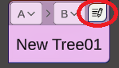
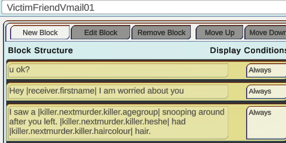
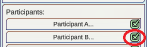
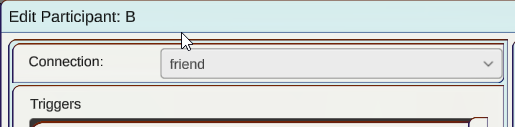
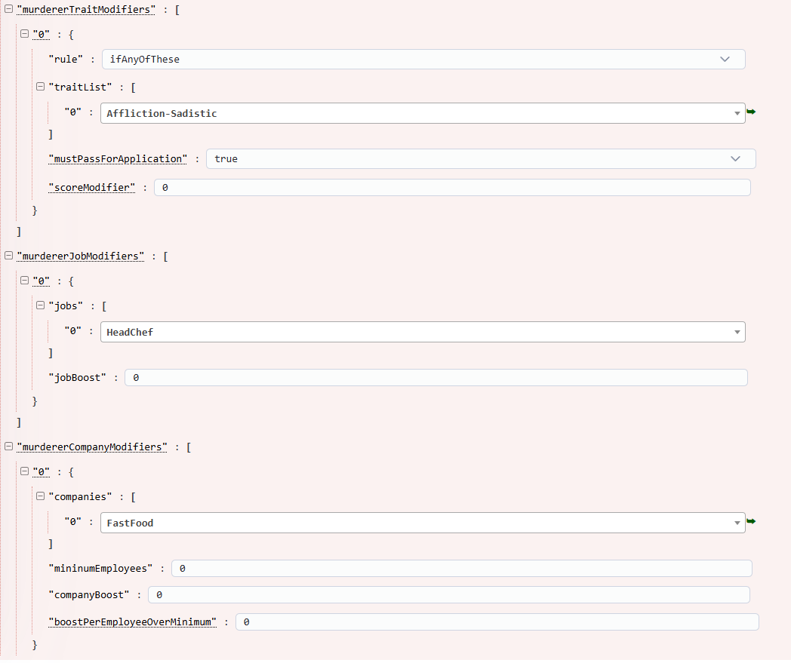
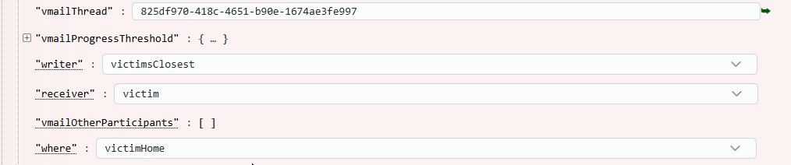

# Shadows Of Doubt Case Editing

## Intro

### Case Editor Tool

Cases can be created and modified using [piepieonline's web based tool](https://www.piepieonline.com/ShadowsOfDoubt-CaseEditor/) using Google Chrome browser.

### DDS Editor Tool

Evidence, dialogue, vMails, and some other things can be modified using [Shadows of Doubt dev team's editor tool](https://colepowered.itch.io/shadows-of-doubt-dialog-editor) or [piepieonline's DDS editor tool](https://www.piepieonline.com/ShadowsOfDoubt-DDSViewer/)

## How to

### Make a basic custom piece of DDS evidence 

This evidence will spawn in the world as a crumpled pieces of paper. 
1. Open the DDS Editor. In a new DDS bundle, create a new tree for a document. 
2. Open the new tree to edit it.
3. Change the background on the right to crumpled paper, the size square, and move the text box back into the main frame of the image. 
4. Click on the message box and then click on edit message the the top
5. On the first block click the cell to edit and enter `CITY NAME: |city.name|`
6. Click new block at the top of the window and enter `NEXT VICTIM: |killer.nextmurder.victim.fullname|` 
7. Click Done at the bottom.


What's happened so far? We have added 2 dynamic text blocks. Referring to the city and the killer's next victim's full name. 


> Tip: you can explore available DDS text by simply entering the first pipe, going up and down with arrows and pressing enter to expand into the next context

### Migrate your DDS data for the custom evidence

The evidence DDS data is created but we need to move it into the folders that meet the structure for the case editor.

1. Drill into your DDS Editor's save folder.

`Shadows DDS Editor Build\Shadows of Doubt DDS Editor_Data\StreamingAssets\DDS\(YOUR BUNDLE)`

2. Open the Case Editor's file folder. 

`ExampleCase\DDSContent`

3. Move files in directories as follows

DDSEditor\Trees -> CaseEditor\DDSContent\DDS\Trees

DDSEditor\Messsages -> CaseEditor\DDSContent\DDS\Messsages

DDSEditor\Blocks -> CaseEditor\DDSContent\DDS\Blocks

4. Move these files as follows

DDSEditor\Strings\English\dds.blocks -> CaseEditor\DDSContent\Strings\English\DDS

5. Create evidence.names in CaseEditor\DDSContent\Strings\English\Evidence
6. Edit evidence.names and add a new row

`KillerNotes,,"Note",,,,11:49 05/03/2025`
> Note the time and date here does not appear to matter. The important entries are KillerNotes and "Note" 

### Create InteractablePreset file for the evidence to spawn in the world
1. In the [case editor tool](https://www.piepieonline.com/ShadowsOfDoubt-CaseEditor/) click Add new file.
2. Select InteractablePreset from the dropdown for File Type, and CrumpledPaper for the Copy From, name your file. Name this file `KillerNotesInteractable`

> Tip: It's important to keep track of your file names and which evidence they tie to. Name your files appropriately! 

3. For simplicity sake in this guide, edit the file directly first and paste this in as the json.

```
{
  "name": "KillerNotesInteractable",
  "fileType": "InteractablePreset",
  "copyFrom": "InteractablePreset|Note",
  "presetName": "KillerNotesInteractable",
  "spawnEvidence": "REF:EvidencePreset|KillerNotesEvidence",
  "fingerprintsEnabled": true,
  "printsSource": 12,
  "summaryMessageSource": "2007b0c9-ed2b-487c-99a8-152a0ba19977",
  "fingerprintDensity": 4
}
```
4. Go back to the case editor tool and open the file. 
5. Refer to your DDS Editor again for the GUID for the evidence in the top right of the window, and copy this value.


6. Paste the value into the summaryMessageSource field in the case editor.

What's going on at this point? We have a file that refers to the DDS we have created and define some basic additional attributes for the evidence that will spawn in the world. The enum should be translated by the case editor tool where printsSource 12 is the killer's prints. We have a placeholder for the evidence file (KillerNotesEvidence) that will be opened in the evidence board. Everything else will be copied from the vanilla Note preset unless overridden.

### Create the EvidencePreset file for the evidence to appear in case board
1. In the [case editor tool](https://www.piepieonline.com/ShadowsOfDoubt-CaseEditor/) click Add new file.
2. Select EvidencePreset from the dropdown for File Type, and CrumpledPaper for the Copy From, name your file. Name this file `KillerNotesEvidence`

> Tip: Again, It's important to keep track of your file names and which evidence they tie to. Name your files appropriately! 

3. Just like for the interactablePreset, edit the file again directly and paste this as the json for simplicity.

```
{
  "name": "KillerNotesEvidence",
  "fileType": "EvidencePreset",
  "copyFrom": "EvidencePreset|CrumpledNameCipher",
  "presetName": "KillerNotesEvidence",
  "ddsDocumentID": "2007b0c9-ed2b-487c-99a8-152a0ba19977
}
```
5. Just like in the InteractablePreset file, make sure the ddsDocumentID is the one from the DDS Editor.

### Prepare the MurderMO file to use the custom evidence
1. In the [case editor tool](https://www.piepieonline.com/ShadowsOfDoubt-CaseEditor/) open the murderMO file that is created by default. 
2. Right click on "MOleads" to add a new entry, then expand the tree.


* Refer to the MurderMO file reference for details on what the fields do.
3. For the example, enter the name `KillerNotes`and fill out the first few entries as follows


| field     | value       |
| ------------- | ------------- |
|compatibleWithAllMotives|true|
|spawnOnPhase|executing|
|tryToSpawnWithEachNewMurder|true|
|belongsTo|killer|
|chance|1|

4. On the spawnItem dropdown, click the entry for custom, and in the prompt that opens, enter `KillerNotesInteractable`


What's set up at this point? We have some basic spawning variables set for the evidence. Most importantly, we have called the custom KillerNoteInteractable file that we created, which will spawn in the world with the settings we applied. The object in the world when interacted with will now refer to the KillerNoteEvidence file we created, which in turn will display the DDS object we created in the editor.

### Define a killer Moniker DDS list
In the DDS Edtitor tool, create a new `Misc` Tree. On the right select "Never" for Trigger On.

Click the top right button on the message to begin editing. 



Each block in the message is a unique individual moniker that the game can select. Ideally you want to include 3-4 of these for variety and in Noir spirit, alliteration is the most common style. Click done at the bottom to save. 


### Define a custom vMail DDS clue
In the DDS Editor tool, create a new `vMail Thread` tree. 

Click the top right button on the message to begin editing. 


The first block is always the subject of the vMail, and is shorter than one might expect. Only about 30 characters are displayed. 

Any number of additional blocks can be added with custom scopes of DDS being used. Click done at the bottom to save it.


In this example message we have included the name of the person receiving the message, and some clues about the appearance of the murderer based off their friend's witness of them. Note all of these values are defined by the game and can be referenced to create a story. In the game's reality the victim's friend may not have actually witnessed the killer lurking about. 

> Tip: you can explore available DDS text by simply entering the first pipe, going up and down with arrows and pressing enter to expand into the next context. 

In the DDS Editor take note of the letters on top of the message indicating the participants of the thread. We must also check the participants off on the right hand side. Which will then open the editor window of the connection, select friend on the dropdown.




Next on the tree viewer, change the dropdowns for the letters on top of the message, this changes the sender and receiver of the message. We are changing it to Participant B, the friend, sending to Participant A, the victim.

 

The last thing to do here is make sure to change Trigger On to `Never` Otherwise this vMail will be used randomly for other citizens in the city.

Next steps for using this can be found in the MurderMO file MOLeads for vMail Evidence section. 


## MurderMO file

### Overview of fields
The MurderMO file will control everything about setting up the procedural murder from who the killer is, who the victim is, the murder location, clues, and more.

#### Trait, Job, and Company modifiers
These values are relatively self explanatory including tips in the case editor for what they do. These values are actually optional and if not defined, a random citizen will be chosen for the roles. Right click to add a node in any section to define keys for these. 


In this example, we have a sadistic head chef at a fast food restaurant. This can be expanded with a number of notes under each. Again, these same traits can be selected in the victim section to be applied in the same way.

#### compatibleWith
This key is important to apply the Murder Preset so the game knows how to script the murderer's actions and methods. Nearly always this must be set to `SerialKiller`. It may be possible through experimentation to apply other methodologies including the Kidnapper case.

#### Weapon pool and allow location modifiers
The weapon pool key and locations are also self explanatory. You can select any number of weapons to be used as a murder weapon like Blades or Guns. 
| allow murder locations| notes|
| --- | ---| 
| allowAnywhere| murder will literally anywhere, this may override all other options|
| allowHome| murder will be at the victim's home|
| allowWork| murder will be at the victim's workplace|
| allowPublic| murder can happen in public, like in the front of a restaurant or building lobby|
| allowStreets| murder can happen on the streets|
| allowDen| murder will happen in the Kidnappers den, currently untested by community. Likely tied to the count down for kidnapper cases.|

#### Victim boost modifiers
The keys can be positive or negative and will influence how much more likely the victim is tied to the killer in a given schema. All of these key names are self explanatory.

#### monkierDDSMessageList
This field influences what is selected as the case name in game like "The Scarlet Slicer". This field is slightly misspelled so ensure you do not correct it if editing in a text editor. This appears in the player's caseboard as well as newspaper articles. This must be defined in a DDS file. The GUID for the tree must be entered into this field. This is optional and the game will select from a list of vanilla monikers if not defined.

#### confessionalDDSResponses
*tbd*

#### MOleads
Right click to add new keys, these are the clues you can provide to the player through custom evidence to regular in game objects. Leads can also be vMail threads defined in the DDS Editor. Some fields are applicable physical evidence or vMails and are optional. All MOleads require a name, a spawnOnPhase value and chance value to work. 
|field|notes|
|---|---|
|name|not visible to player, used to keep track or notes of what the object is.|
|spawnOnPhase| the point in the murder's progression where the lead is created. Usually `research` or `executing`|
|chance|value from 0 to 1 indicating the percent chance the evidence is spawned. 0.5 is half of the time.|
|itemTag|to be safe, set a unique tag for each piece of evidence unless working on advanced logic.|

##### Trait modifiers
Just like controlling the traits of the victim and murderer, evidence can be used based on the traits of *only* the murderer. Simply add any number of keys by right clicking and make sure `useTraits` is `true`. 

##### MOLeads for Physical Evidence
The main fields to modify for Physical evidence will determine whose prints appear on the object, what it is, and where it spawns.
|field|notes|
|---|---|
|belongsTo|usually `killer` or `victim` but cases can use a number of values in the dropdown here to make a story.|
|spawnItem|the actual physical object spawned in the world. Example for custom evidence uses a custom name, but literally anything can be selected in here within reason.|
|where|the place the object will be spawned both killer and victim home and work|

##### MOLeads for vMail Evidence
This can be tricky to get right and a few of the fields relate to the scope from the DDS Editor. We will use the vMail evidence example from this guide to continue working on the vMail section. Consider the directionality logic of writer and receiver as well as the participants from the vMail evidence.

In our example Participant B is writing the vMail to Participant A, who is the victim. 


|field|notes|
|---|---|
|vmailThread|GUID value from the top right of the DDS Editor for the tree.|
|writer|the person writing the vMail|
|receiver|the person receiving the vMail|
|vMailOtherParticipants|optional, advanced for multithreaded or multiparticipant vMails.|
|where|probably optional, set to `victimHome` to be safe.|


##### Other MOleads fields
There are a number of fields related to tags, if, or, groups, and chance. These will be discussed as much as I understand them but more experimentation is required.

###### IF Logic
|field|notes|
|---|---|
|useIf| `true` or `false` controls additively using more evidence if a prior one is utilized. When set to true, the evidence will only spawn if a piece of evidence with the ifTag is spawned.|
|ifTag|controls which evidence tag is used for conditionally adding more evidence|

When working with `if`, consider we have a lower chance piece of evidence spawning, and it only makes sense to spawn this second piece if the first exists. Maybe there is a threatening letter written to the victim, and they may write their own response or diary based on this. 
* In that case the threatening letter would be `itemTag` `A` and the response would be `itemTag` `B`. 
* So on the MOlead item for the threatening note `itemTag` is `A`, no `ifTag` would be used, and `useIf` would be set to `false`.
* On the MOlead item for the response `itemTag` is `B`, `useIf` is `true` and `ifTag` is set to `A`

###### OR Logic
|field|notes|
|---|---|
|useOrGroup|`true` or `false` controls using or logic to conditionally spawn evidence|
|orGroup| defines the itemTag(s) used for conditionally spawning evience|
|chanceRatio| probably controls the chance of one item spawning versus the other, in experiments setting to 1 seems to cause no issue.|

When working with `or`, consider we have a couple variants of evidence we want to spawn, maybe each with a different clue on the description of the murderer. Maybe `itemTag` `A` tells the killer's home building, or `itemTag` `A` tells the killers work building. We do not want to give the player too much information so we want to spawn just one or the other. 

* In this case, the home building note and the work building note have the same `itemTag` of `A`
* both pieces have `orGroup` set to `A`, and `useOrGroup` is set to `true`

###### Additional logic (Security, ownership)
|field|notes|
|---|---|
|security|only applies to physical evidence and can control the level of security in which a object spawns. For example `0` is anywhere in the open, `1` is atleast in a drawer, `2` is in a safe. This is all relative to the furniture in the room in which the object is spawning. If no safe exists, a drawer may be consider the highest level of security.|
|ownershipRule| *tbd* seems to control where/who the room must be owned by to spawn. The safest option here is `both`|

## Murder Manifest file

## Interactable Preset file
